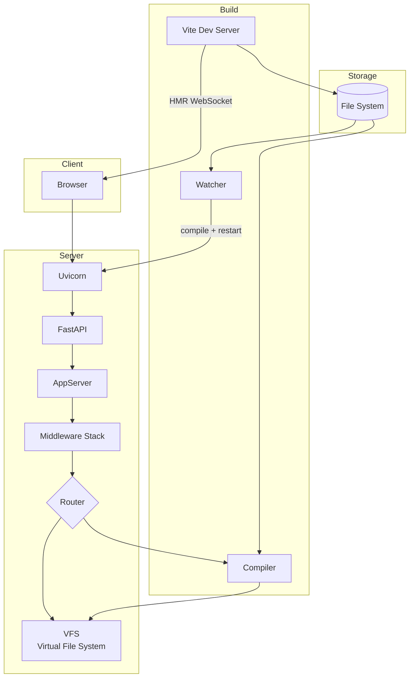
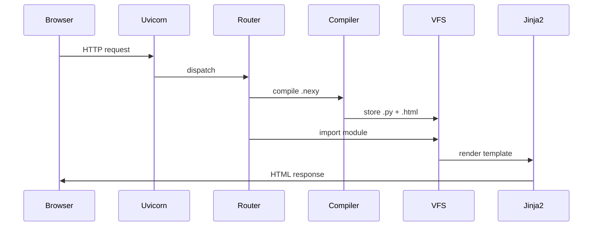
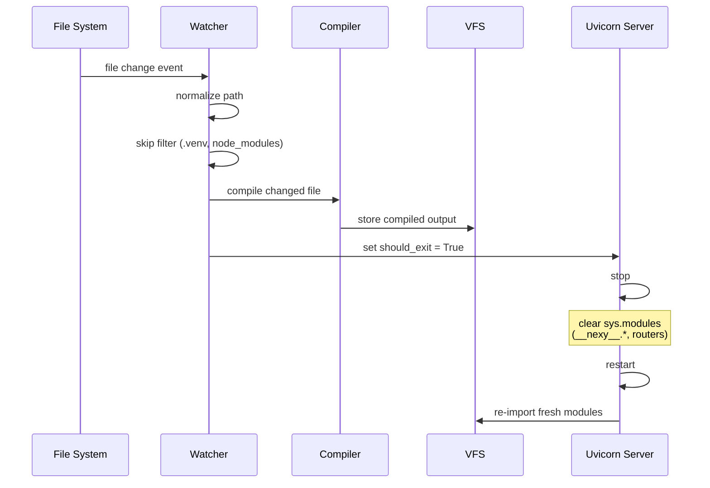
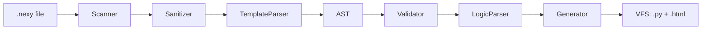

# Architecture

## Overview

Nexy is a full-stack Python meta-framework that bridges FastAPI backends with
Vite-powered frontends (React, Vue, Svelte, Solid, Preact). It compiles `.nexy`
components at runtime through a Virtual File System (VFS), and a file watcher
triggers clean uvicorn restarts — no importlib hacks, no stale modules.

## System diagram



## Data flow

### Request lifecycle



### Dev mode file watching



## Project structure

```
nexy/
├── cli/                        # Typer CLI (nx, nexy commands)
│   ├── __init__.py             # CLI app entry
│   └── commands/               # dev, start, build, init, new
├── compiler/                   # .nexy compilation pipeline
│   ├── parser/
│   │   ├── scanner.py          # --- frontmatter extraction
│   │   ├── sanitizer.py        # framework-specific rewrites
│   │   ├── template.py         # HTML → AST → Jinja2
│   │   ├── validator.py        # prop validation
│   │   └── logic.py            # Python frontmatter → Jinja2 context
│   └── generator/              # Python code generation
├── core/                       # Framework core
│   ├── config.py               # NexyConfigModel (nexyconfig.py)
│   └── models.py               # Pydantic models
├── routers/
│   ├── app.py                  # AppServer assembly
│   ├── fbrouter/               # File-based router
│   └── actions/                # Route action handlers
├── frontend/                   # Client framework integration
│   ├── react.py, vue.py, svelte.py, solid.py, preact.py
│   ├── runtime.ts              # Browser runtime
│   └── vite.ts                 # Vite plugin
├── vfs/                        # Virtual File System (PEP 302)
│   ├── finder.py               # Module finder
│   └── loader.py               # Module loader
├── utils/
│   ├── dev/                    # Dev server, watcher, HMR
│   ├── init/                   # Project initialization
│   └── server/                 # Server config, port mgmt
├── i18n/                       # Internationalization
└── templates/                  # Project scaffold templates
```

## Key modules

### Virtual File System (VFS)

In-memory singleton storing compiled `.py` and `.html` files.
Survives across uvicorn restarts — always has fresh compiled content.

- **NexyVFSFinder** (PEP 302): intercepts `__nexy__.*` imports
- **NexyVFSLoader**: loads from VFS instead of disk
- Registered via `sys.meta_path` at startup

### Compiler pipeline



1. **Scanner** — extracts `---` frontmatter delimiter
2. **Sanitizer** — rewrites framework-specific syntax (vue ↔ react ↔ nexy)
3. **TemplateParser** — HTML to AST, validates component references, excludes built-in `Slot`
4. **LogicParser** — compiles Python frontmatter to Jinja2 expressions
5. **Generator** — produces `__nexy__/*.py` and `__nexy__/*.html` in VFS

### Routing

**File-based router (FBR)**: `src/routes/index.nexy` → `/`,
`src/routes/blog/[slug].nexy` → `/blog/{slug}`. Auto-discovery from filesystem,
`_layout.nexy` files for shared layouts, supports `.nexy`, `.mdx`, `.py`.

**Modular router**: NestJS-inspired apps with `app_controller.py` + `app_module.py`.
Decorator-based routing with dependency injection (`@Injectable`, `@Controller`, `@Module`).

## Design decisions

| Decision | Rationale |
|----------|-----------|
| VFS instead of disk | No filesystem pollution, instant re-import |
| uvicorn restart > importlib.reload | Module cache clearing is deterministic |
| esbuild > Vite for SSR | Per-file builds, no Vite dependency in production |
| Jinja2 for .nexy | Mature, extensible, same engine as Django |
| Custom watcher > uvicorn --reload | Fine-grained control, debouncing, Vite coordination |
| sys.modules clearing | Fresh module state on every restart |
| Pydantic for config | Type safety, IDE autocomplete, schema gen |
| Slot as built-in component | No import needed in .nexy — always available |

## Performance

- **Startup**: <200ms (compile + server ready)
- **HMR**: <100ms file change → browser refresh
- **SSR**: ~5-15ms per component (esbuild)
- **SSG**: Parallel worker pool (`os.cpus().length` workers)

## Security

- Jinja2 auto-escaping (XSS protection)
- CORS, GZip, TrustedHost, Session, Auth middleware
- Signed session cookies
- Environment variables for secrets (never hardcoded)
- No arbitrary code execution in templates
