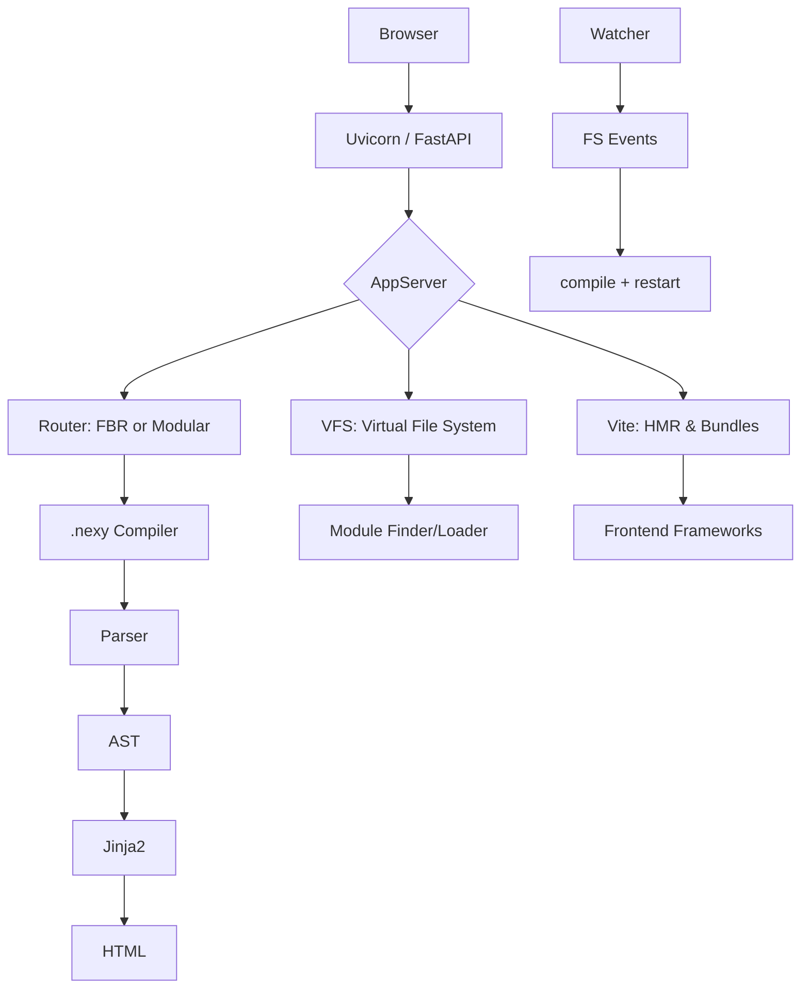

<p align="center">
  
</p>

<h1 align="center">Nexy</h1>

<p align="center">
  <em>The fullstack Python meta-framework — <strong>sub-second startup, sub-100ms HMR</strong></em>
</p>

<p align="center">
  <a href="https://pypi.org/project/nexy">
    
  </a>
  <a href="https://pypi.org/project/nexy">
    
  </a>
  <a href="https://github.com/NexyPy/nexy">
    
  </a>
  <a href="LICENSE">
    
  </a>
  <a href="https://github.com/NexyPy/nexy/commits/main">
    
  </a>
</p>

---

## Why Nexy?

Most Python web frameworks force you to choose: backend **or** frontend. Nexy is the first Python meta-framework that seamlessly bridges FastAPI with Vite-powered frontends (React, Vue, Svelte, Solid) — without sacrificing DX or performance.

| You get | Instead of |
|---------|------------|
| **Sub-second startup** | Waiting 10-30s for Next.js/Rails |
| One `.nexy` file = backend + frontend | Separate projects for API + UI |
| Zero-config Vite integration | Manually wiring Webpack/Vite |
| Framework-agnostic UI | Being locked into one JS framework |
| SSR + SSG out of the box | Adding SSG as an afterthought |

## Quick start

```bash
# Create a project — no pip install needed
uvx nexy new

# Start developing
cd my-project && nexy dev
```

That's it. Your browser opens at `http://localhost:3000` with HMR, FastAPI backend, and Vite frontend — all hot-reloading on save.

## Code example

One `.nexy` file. Server-rendered HTML + interactive frontend component.

```html
---
title : prop[str] = "Dashboard"
from "@/components/Chart.tsx" import Chart
---

<h1>{{ title }}</h1>

<Chart data="{{ api_data }}" />
```

The `---` block is Python: declare props, import components. Below is Jinja2: server-rendered HTML. Frontend frameworks hydrate on top via Vite.

## Features

### .nexy — polyglot components

A single file format that mixes Python, Jinja2, and your UI framework of choice.

```
┌─────────────────────┐
│  ---                │  ← Python logic (props, imports)
│  title : prop[str]  │
│  ---                │
│  <h1>{{ title }}</h1>│  ← Jinja2 template (SSR)
│  <Chart />           │  ← TS/JS client island
└─────────────────────┘
```

### Dual routing — scale with your project

- **File-based**: `src/routes/index.nexy` → `/`, `src/routes/blog/[slug].nexy` → `/blog/{slug}`
- **Modular**: NestJS-inspired decorator-based routing for enterprise apps
- **Hybrid**: Mix static pages and dynamic API routes in the same project

### Framework-agnostic frontend

Import React, Vue, Svelte, Solid, or Preact components directly into your `.nexy` templates. No adapter, no bridge, no configuration.

```python
# Works in any .nexy file
from "@/components/Chart.tsx" import Chart     # React/Solid/Preact
from "@/components/Table.vue" import Table     # Vue
from "@/components/Card.svelte" import Card    # Svelte
```

### Production-grade SSR & SSG

- **SSR**: Server-side rendering for every component (esbuild per-file, no Vite dependency)
- **SSG**: Parallel static generation with worker pool
- **Automatic**: Framework detection from imports, zero config

### CLI — one tool to rule them all

| Command | Purpose |
|---------|---------|
| `nexy new` | Scaffold a new project |
| `nexy dev` | Dev server with HMR |
| `nexy build` | Production build |
| `nexy start` | Production server |

## Architecture at a glance



## Supported frontend frameworks

| Framework | Status | SSR | SSG | HMR |
|-----------|--------|-----|-----|-----|
| React | Stable | ✓ | ✓ | ✓ |
| Vue | Stable | ✓ | ✓ | ✓ |
| Svelte | Stable | ✓ | ✓ | ✓ |
| Solid | Stable | ✓ | ✓ | ✓ |
| Preact | Stable | ✓ | ✓ | ✓ |
| None (vanilla) | Stable | ✓ | — | ✓ |

## Project status

Nexy is in active development. The core features are stable and production-ready.
We welcome contributions of all kinds — bug reports, feature requests, and pull requests.

See [CONTRIBUTING.md](CONTRIBUTING.md) to get started, or browse [good first issues](https://github.com/NexyPy/nexy/issues?q=is%3Aissue+is%3Aopen+label%3A%22good+first+issue%22).

## Community

- [GitHub Issues](https://github.com/NexyPy/nexy/issues) — bug reports, feature requests
- [GitHub Discussions](https://github.com/NexyPy/nexy/discussions) — questions, ideas
- [Documentation](https://nexy.ai/docs) — full reference
- [Contributor Covenant](CODE_OF_CONDUCT.md) — code of conduct

## License

Nexy is open-source software licensed under the [MIT License](LICENSE).
