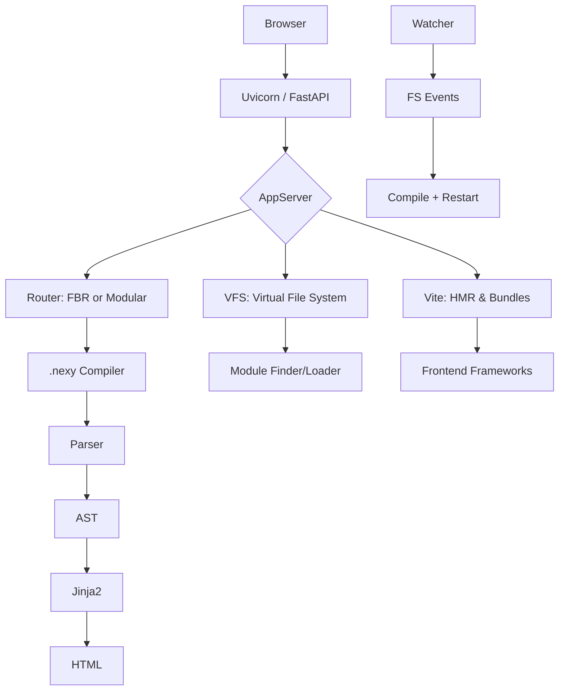

<p align="center">
  
</p>

<h1 align="center">Nexy</h1>

<p align="center">
  <em>The fullstack Python meta-framework — sub-second startup, sub-100ms HMR, zero-config Vite.</em>
</p>

<p align="center">
  <a href="https://pypi.org/project/nexy">
    
  </a>
  <a href="https://pypi.org/project/nexy">
    
  </a>
  <a href="https://github.com/NexyPy/nexy">
    
  </a>
  <a href="LICENSE">
    
  </a>
  <a href="https://github.com/NexyPy/nexy/commits/main">
    
  </a>
  <a href="https://github.com/NexyPy/nexy/actions/workflows/ci.yml">
    
  </a>
  <a href="https://github.com/NexyPy/nexy/blob/main/CONTRIBUTING.md">
    
  </a>
</p>

---

## Why Nexy?

Every Python web framework forces you to choose: backend **or** frontend. Nexy is the first Python meta-framework that bridges FastAPI with Vite-powered frontends (React, Vue, Svelte, Solid, Preact) in a single file — without sacrificing DX or performance.

**Design-Driven Engineering** — an API so clean it feels like a DSL, architecture so fast you forget it's there.

| You get | Instead of |
|---------|------------|
| **Sub-second startup** | 10–30s waiting for Next.js, Rails, Django |
| One `.nexy` file = backend + frontend | Separate projects for API + UI + build tooling |
| Zero-config Vite integration | Manually wiring Webpack, Vite, Parcel |
| Framework-agnostic UI components | Being locked into React or Vue |
| SSR + SSG out of the box, parallel build | Adding SSG as an afterthought |

---

## Quick start

```bash
# No pip install needed
uvx nexy new

# Start developing — HMR, FastAPI, Vite, all hot-reloading
cd my-project && nexy dev
```

Your browser opens at `localhost:3000`. Change a file. Instant feedback. No waiting.

---

## The `.nexy` file — one format, three layers

A single file that mixes Python, Jinja2, and your frontend framework of choice.

````html
---
title : prop[str] = "Dashboard"
from "@/components/Chart.tsx" import Chart
---

<h1>{{ title }}</h1>

<Chart data="{{ api_data }}" />
````

| Layer | Language | Role |
|-------|----------|------|
| `---` frontmatter | Python | Props, imports, server logic |
| Body | Jinja2 | Server-rendered HTML |
| Components | TS/JS/Vue/Svelte | Interactive islands via Vite |

---

## Architecture


```mermaid
graph TD
    A[Browser] --> B[Uvicorn / FastAPI]
    B --> C{AppServer}
    C --> D[Router: FBR or Modular]
    C --> E[VFS: Virtual File System]
    C --> F[Vite: HMR & Bundles]
    D --> G[.nexy Compiler]
    G --> H[Parser] --> I[AST] --> J[Jinja2] --> K[HTML]
    E --> L[Module Finder/Loader]
    F --> M[Frontend Frameworks]
    N[Watcher] --> O[FS Events]
    O --> P[Compile + Restart]
```

**Key design choice:** Nexy uses a per-file esbuild compilation pipeline for SSR — no Vite dependency in production. Worker-pool parallelism for SSG. This means sub-second rebuilds regardless of project size.

---

## Comparisons

| Feature | Nexy | Next.js | Django + Htmx | Remix |
|---------|------|---------|---------------|-------|
| Language | Python + any JS framework | JS/TS only | Python + htmx | JS/TS only |
| Startup | < 1s | 10–30s | 3–8s | 8–15s |
| HMR | < 100ms | ~500ms | N/A | ~300ms |
| File format | `.nexy` (Python + Jinja2 + UI) | `.tsx`/`.jsx` | `.py` + `.html` | `.tsx` |
| SSR | Built-in (esbuild) | Built-in (React) | Manual | Built-in (React) |
| SSG | Parallel worker pool | `next export` | Third-party | Via Vite |
| Routing | File-based + Modular (hybrid) | File-based | Manual | File-based |

---

## Supported frontend frameworks

| Framework | SSR | SSG | HMR |
|-----------|-----|-----|-----|
| React | ✓ | ✓ | ✓ |
| Vue | ✓ | ✓ | ✓ |
| Svelte | ✓ | ✓ | ✓ |
| Solid | ✓ | ✓ | ✓ |
| Preact | ✓ | ✓ | ✓ |
| None (vanilla) | ✓ | — | ✓ |

---

## CLI

| Command | Purpose |
|---------|---------|
| `nexy new` | Scaffold a new project with your framework of choice |
| `nexy dev` | Dev server with sub-100ms HMR |
| `nexy build` | Production build (SSR + SSG + client bundles) |
| `nexy start` | Production server (Uvicorn + FastAPI) |

---

## Roadmap

- [x] Core compiler & dual routing (file-based + modular)
- [x] Vite integration with HMR for React, Vue, Svelte, Solid, Preact
- [x] Parallel SSG with worker pool
- [ ] Native CLI scaffolding with framework selection wizard
- [ ] One-click deployment (Docker, Vercel, Fly.io)
- [ ] First-class AI/agent endpoint support

---

## Contributing

We welcome contributions from everyone — whether you're a seasoned Rust/Python engineer or writing your first open-source PR.

- **Good first issues** — [browse the label](https://github.com/NexyPy/nexy/issues?q=is%3Aissue+is%3Aopen+label%3A%22good+first+issue%22)
- **Architecture discussions** — [GitHub Discussions](https://github.com/NexyPy/nexy/discussions)
- **Code of conduct** — [Contributor Covenant](CODE_OF_CONDUCT.md)
- **Contribution guide** — [CONTRIBUTING.md](CONTRIBUTING.md)

See something you want to improve? Open a PR. Architecture proposals, bug fixes, documentation, tests — all count.

---

## Community

- [Documentation](https://nexy.ai/docs) — full reference
- [GitHub Issues](https://github.com/NexyPy/nexy/issues) — bug reports & feature requests
- [Discord](https://discord.gg/nexy) — community chat

---

## License

Nexy is open-source software licensed under the [MIT License](LICENSE).
